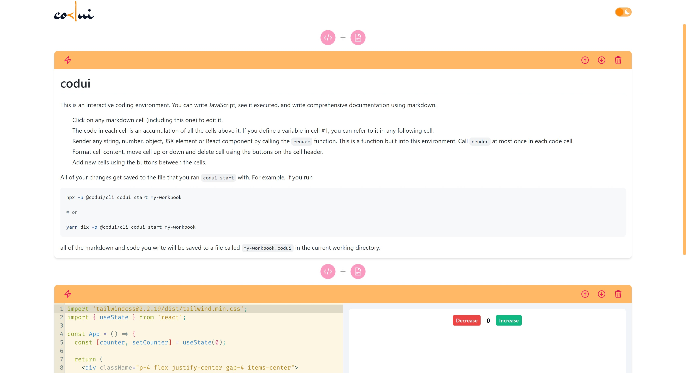
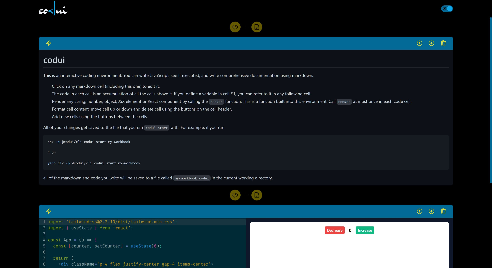

# codui

Launch a JavaScript code and markdown editing environment in your browser.

## Installation

Install `@codui/cli` globally

```bash
# npm
npm install -g @codui/cli

# yarn
yarn global add @codui/cli
```

## Usage/Examples

If you have installed the package globally, you use the `codui` command

```bash
codui start [options] [workbook]
```

If you want to run the command directly without installing, you can use `npx` or `yarn dlx`

```bash
# npm
npx -p @codui/cli codui start [options] [workbook]

# yarn

yarn dlx -p @codui/cli codui start [options] [workbook]
```

### Arguments

`workbook` - name of workbook to run (default: "workbook")

### Options

`-p`, `--port` - http port to launch server on (default: "4000")

## Features

- Light/dark mode toggle
- Live previews

## Screenshots

### Light Mode



### Dark Mode



## License

[MIT](LICENSE)
